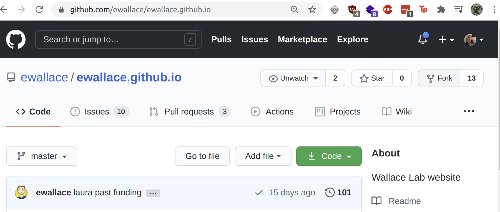

# Favourite Papers Task Instructions
## Lab Git Workshop

Author: Flic Anderson

Date: 27 Nov 2020

** Git Workflow: Fork, Clone, Branch, Edit, Add, Commit, Push, Pull Request**

These instructions presume you've already got `git` set up (instructions[HERE](setup_git.md) if not), and you've already created a [GitHub](https://github.com/) user account.  If you haven't, please let me know and do those steps or none of the stuff below will work! :)

## On Github

As we've mentioned, GitHub is an online platform for storing git repositories. You can see the [Wallace Lab website](https://ewallace.github.io/) repository [HERE](https://github.com/ewallace/ewallace.github.io).  

*Open this in your browser and have a look at the page!*

Various tabs on the GitHub repository page show different options:

#### Code

Here you can see the 'code' (all the files and folders), details of when those files and folders were last changed, and various other details.  

It will also show you which `branch` of the repository you're viewing, in a drop-down menu towards the top left. The default view is the main branch, usually called the `master` branch. If you select other branches, you'll see the files from those branches. Keep an eye on which branch you're viewing, this is often where you can end up getting confused looking for files that don't exist in the branch you're viewing :)

A LICENCE file will tell you what you're allowed to do with the contents of the repo - if you can use any of the code or materials, and what you can do (ie if you can edit or change them, whether you have to attribute the original creators, whether you can use them in commercial or non-commercial ways etc.).

The README file is a key file which should contain information about the repository, and any details on how to get started using it.  It might include notes on how to contribute to it, or any citation information.

#### Issues

Here you'll see `issue tickets` which have been created to discuss or track issues, problems, new features or new ideas to be worked on in this repository. You can filter between 'closed' (completed or issues the repo owner has decided they won't fix), and 'open' issues (which might be in progress, or just 'to do').  You can add tags to specify types of issue.

#### Pull Requests

This tab will show any `pull requests` that have been made to the repository - where code from the repo has been edited (using `git add`, `git commit` and `git push` commands to track, describe and push the changes up to GitHub) and the code is waiting to be checked and reviewed by the repo owner.  The owner can then decide to accept and `merge` the changes into the repository, to add those changes.

We're going to make changes, create a pull request, and Edward will review them and merge them later to add them to the lab website repo!

### Forking The Repo

In order to make changes to the lab website, we want to be able to edit it. But we might not have access which allows us to directly edit Edward's repo.  We might also want to work in a 'copy' of the website to avoid breaking it with any changes.  

The best way to do this, is by working in a `fork` of the lab website.  This is effectively where we copy the git repository log which contains all the details of all the changes which make up all the files for the website.

We can then work in our personal `fork` (aka copy) of the original website, without fear of breaking anything on the website.  

#### Are you forked already?

You should be able to tell if you've already got a version of the lab website in a few ways.

You can try going to the lab website repository and attempting to fork it using the 'fork' button. If you already have a version forked, then it will tell you. Easy!  You can then click on it to view your fork. Great!

Alternatively you can check in your list of repositories, accessible from the top right corner of GitHub pages, where you can view your profile and settings etc. There's an option "Your Repositories" and you can scroll down to it, or filter "Type" by "fork" to see all your forks.

If you already have a fork of the lab website, there's an extra step to make sure you've got the latest changes in Edward's original repo!

Do you have a local (ie on your computer in front of you) folder called `ewallace.github.io`?  

## On Your Computer

If you DON'T have a folder called `ewallace.github.io`, you probably haven't `cloned` your fork of the repository yet. You can pass go and proceed to the next heading! (Do not collect £200).

If YES, you've already done the `git clone` step.  There are separate instructions to follow, because we want to make sure you've got those latest changes.  Please follow [THESE INSTRUCTIONS](already_forked.md) if you have a pre-existing fork of the lab website repo.
